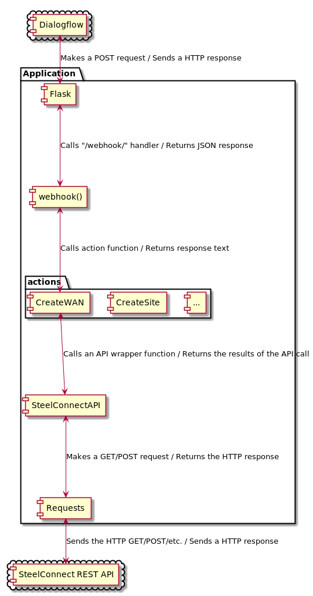

# Design
This is an attempt to retroactively document the design of the application.

## Overview
A high level overview of what this application does:

- You set up Dialogflow with a webhook pointing to a running instance of this app.
- Whenever Dialogflow receives a message from somewhere (eg. Telegram bot), it decodes it into intent, objects, etc., then sends a HTTP POST to this app with the decoded information.
- This app then interacts with the SteelConnect REST API and carries out the specified action.
- This app then sends a response back to DialogFlow with what to say back to the user.

The application uses the [Flask framework](http://flask.pocoo.org/) to host a webserver. It listens for POST requests from Dialogflow on the `/webhook/` route - the handler function is `app.webhook()`. It uses the `requests` library to make requests to the SteelConnect REST API.

## SteelConnectAPI
This class wraps the SteelConnect REST API, and lives in `actions/api.py`. Each class instance is given API auth credentials, the base URL for the SteelConnect Manager instance config API, and an organisation ID (which is used as the implicit target organisation for all actions (but see #1). This class makes calls to the API via the Python requests library.

## Actions
Apart from `api.py`, each file in `actions/` corresponds to an action that can come from Dialogflow (in theory anyway, some files appear to be experiments or unfinished actions, eg. `actions/create_wan_new.py`). Each file contains a single function which takes a SteelConnectAPI object, the parameters from Dialogflow, and in some cases the contexts from Dialogflow. Each action function calls out to the SteelConnect API in some way via the passed object, and returns the text response to give back to the user. This response is sent back to Dialogflow as the response to the POST request.

## Action Dispatch
In the webhook handler in `app.py`, after taking the necessary data out of the Dialogflow POST request JSON, there is an "if-elif" chain that checks the action name and runs the appropriate action. The response text is collected from the action function, formatted in JSON, and sent back to Dialogflow.

## Diagram
Here's a diagram that summarises the rest of this document. Each link between components has a note of the form "<down-action> / <up-action>", where the down-action is what the thing on the top sends to the one below, and vice versa for the up-action.

 